# GitOps-Nginx 操作指南

## 项目简介

`gitops-nginx` 是一款专为运维和开发设计的 Nginx 配置管理平台。它基于 **GitOps** 核心理念，以 Git 仓库作为“单一事实来源”（Single Source of Truth），实现了 Nginx 配置的版本化、自动化校验与安全分发。

本工具旨在解决传统手动修改 Nginx 配置带来的：
- **无法追溯**：修改记录难以审计。
- **校验风险**：上线前漏掉 `nginx -t` 导致服务宕机。
- **环境一致性**：多台服务器配置同步困难。

### 核心特性

- **准实时感知**：利用 `fsnotify` 监听本地变更，实时反馈到 Web 界面。
- **安全预检**：应用配置前自动在目标机器执行远程隔离预检。
- **可视化差异**：直观展示本地、Git 仓库与生产环境的配置差异。

---

## 快速上手：两种配置变更模式

`gitops-nginx` 支持灵活的工作流，满足从“快速调试”到“严格上线”的不同场景。

### 1. 极速调试模式：基于本地文件修改

此模式适合在开发或测试阶段，直接在控制台所在的服务器上修改文件，并立即查看效果。

#### 预览阶段 (Preview Mode)
预览模式允许你像在远程 Nginx 服务器上操作一样实时调试配置。

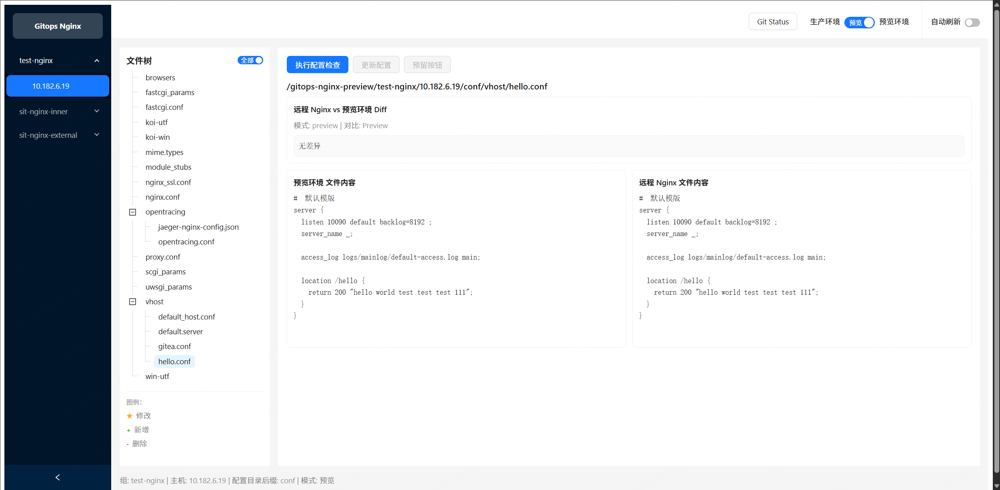

服务器目录结构如下：

- **操作方式**：你可以在 gitops-nginx 所在服务器上，直接使用 `vim` 修改 Git 工作区目录（如 `/app/repo/`）下的文件。
- **实时同步**：任何保存动作都会通过 `fsnotify` 立即推送到前端展示。

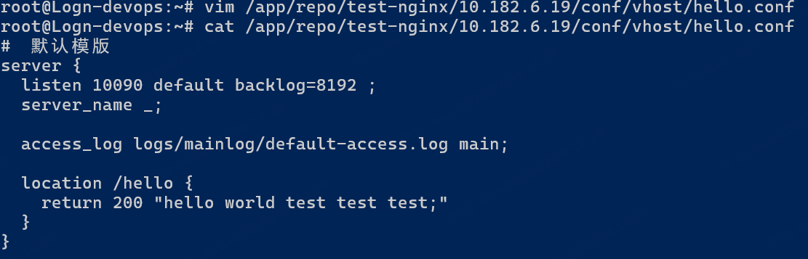

**文件状态标识**：
- **★ 修改**：文件内容已变动。
- **+ 新增**：新创建的配置文件。
- **- 删除**：已被移除的文件。

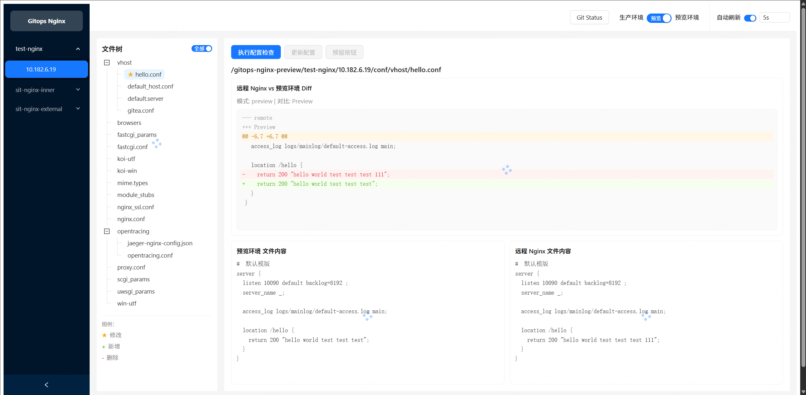

#### 远程预检 (Pre-check)
在预览模式下，点击“校验”按钮，系统会将当前工作区的所有变更递归同步到目标 Nginx 服务器的**临时隔离目录**（如 `/app/nginx/.check/`），并执行 `nginx -t`。

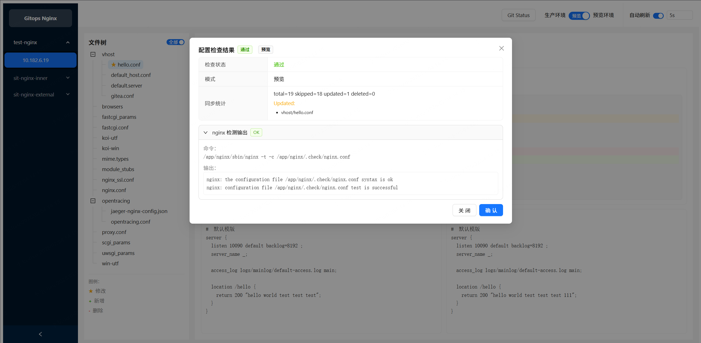

- **安全性**：校验过程不会影响现有的 Nginx 运行状态。
- **反馈**：如果存在语法错误（如漏掉分号），控制台将直接显示 Nginx 报错详情。

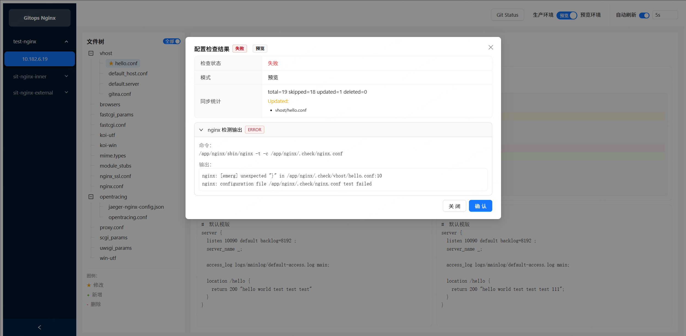

#### 生产应用 (Production Mode)
当你在预览模式确认配置无误后，需要将变更 `commit` 到本地仓库，才能在“生产模式”中应用。

本地提交：

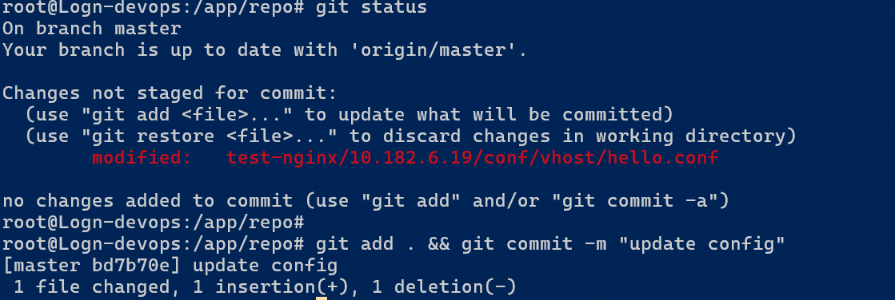

本地领先：

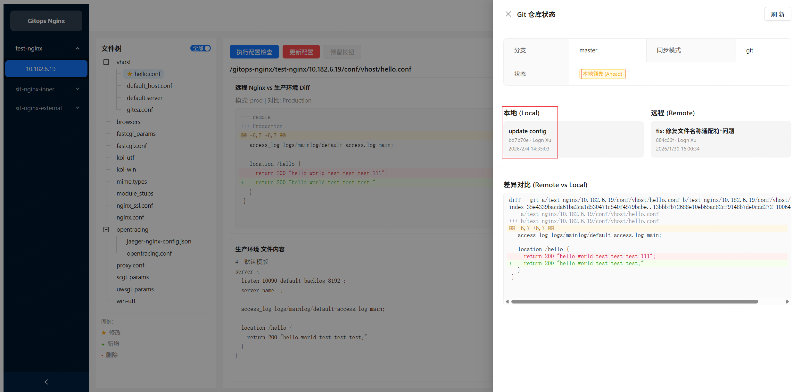

`git push` 后进行更新预检查：

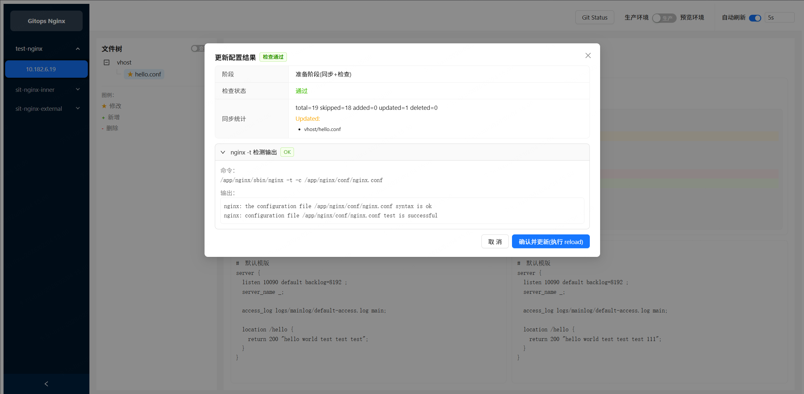

更新配置：

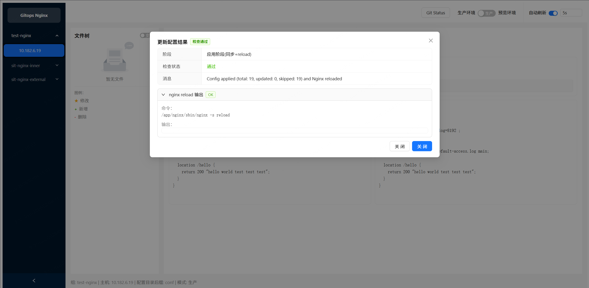

1. **提交变更**：在服务器终端执行 `git add . && git commit -m "update config"`。
2. **状态感知**：Web 界面会检测到本地提交，并显示仓库状态为 **Ahead (本地领先)**。
3. **执行更新**：点击“更新”按钮，系统将完成最后的生产预检，并正式 reload 远程 Nginx 服务。

---

### 2. 标准 GitOps 流程：基于 Git 远程提交

这是最推荐的生产流程，适合多人协作和审计。

1. **本地开发**：在自己的电脑上通过 Git 管理 Nginx 配置。
2. **本地提交并推送到远程**：将修改推送到远程 Git 仓库（如 GitHub/GitLab/Gitea）。
3. **自动拉取**：`gitops-nginx` 会根据配置的轮询间隔，自动拉取远程变更。
4. **一键上线**：在生产模式下确认差异，点击应用。

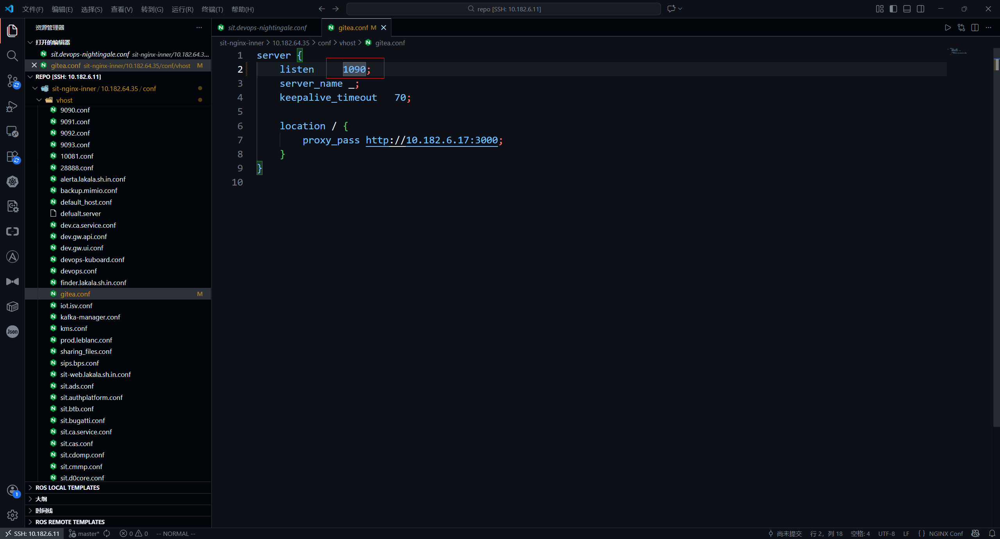

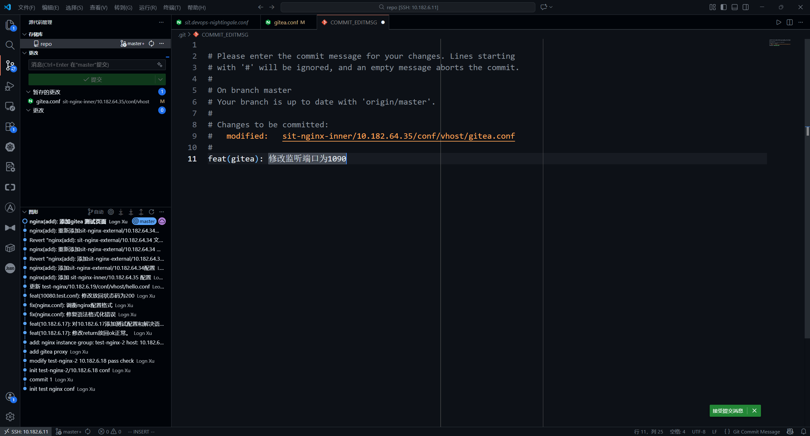

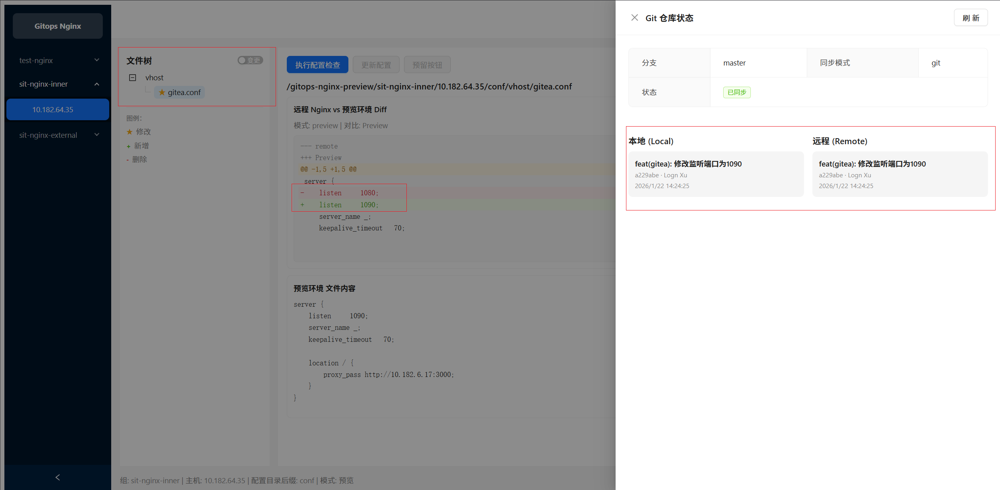

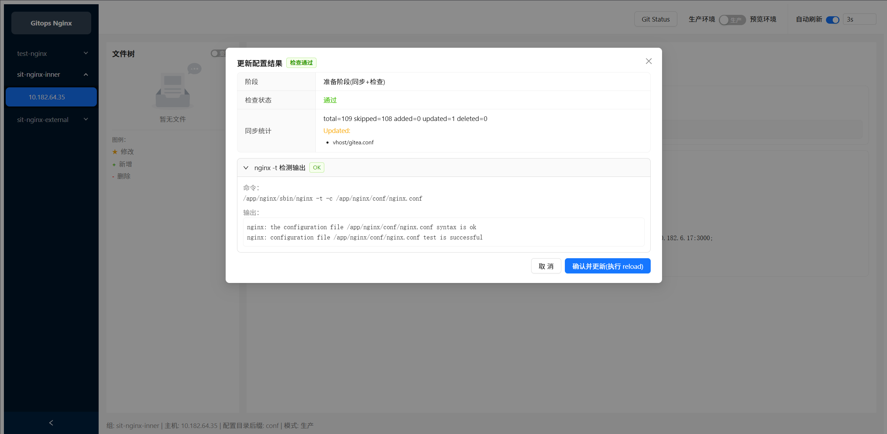

验证更新效果如下：

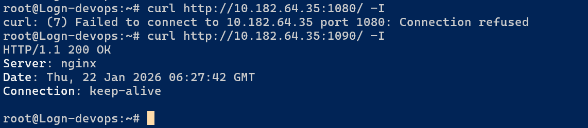

---

## 路线图 (Roadmap)

我们正在持续优化，以下功能即将上线：
- [ ] **版本持久化**：记录 Nginx 当前运行的具体 Release 版本。
- [ ] **发布历史审计**：详细记录谁在什么时候操作了哪台服务器。
- [ ] **快速回滚**：支持基于 `git revert` 或快照的秒级回滚。
- [ ] **多分支灰度**：支持将不同分支的配置应用到不同的服务器组。

---

## 最佳实践建议

- **生产环境**：务必使用 **SSH Key** 进行认证，避免在配置文件中明文存储密码。
- **配置隔离**：建议为不同的业务组划分不同的 Nginx 服务器组，并在 Git 仓库中使用文件夹进行隔离。
- **定期备份**：虽然工具提供了同步功能，但定期备份目标机器的 `/etc/nginx` 依然是良好的习惯。
